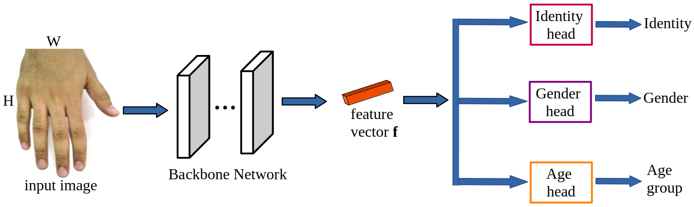
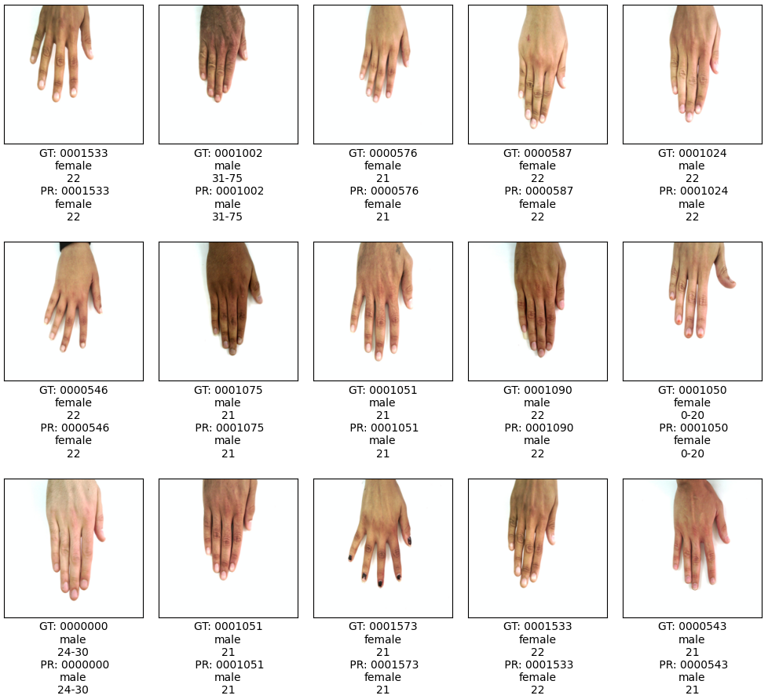

# Joint Person Identity, Gender and Age Estimation from Hand Images using Deep Multi-Task Representation Learning

Code for the paper [Joint Person Identity, Gender and Age Estimation from Hand Images using Deep Multi-Task Representation Learning](https://arxiv.org/abs/2303.15263).


## Overview
In this paper, we propose a multi-task representation learning framework to jointly estimate the identity, gender and age of individuals from their hand images for the purpose of criminal investigations since the hand images are often the only available information in cases of serious crime such as sexual abuse. We investigate different up-to-date deep learning architectures and compare their performance for joint estimation of identity, gender and age from hand images of perpetrators of serious crime. To simplify the age prediction, we create age groups for the age estimation. We make extensive evaluations and comparisons of both convolution-based and transformer-based deep learning architectures on a publicly available 11k hands dataset. Our experimental analysis shows that it is possible to efficiently estimate not only identity but also other attributes such as gender and age of suspects jointly from hand images for criminal investigations, which is crucial in assisting international police forces in the court to identify and convict abusers. 

The proposed architecture of the identity, gender and age estimation network (IGAE-Net) is shown below.




The qualitative results of our proposed method are also shown below. 



Some qualitative results of our proposed method on right dorsal of [11k](https://sites.google.com/view/11khands) hands dataset using [Swin-T](https://arxiv.org/abs/2103.14030)-based IGAE-Net. The ground truth labels (GT) vs the predicted labels (PR) of identity, gender and age group of each hand image, respectively, are shown.


## Installation

1. Git clone this repo: `git clone https://github.com/nathanlem1/IGAE-Net.git`
2. Install dependencies by `pip install -r requirements.txt` to have the same environment configuration as the one we used. Note that we trained all models on a single NVIDIA GeForce RTX 2080 Ti GPU.


## Data Preparation
We use [11k](https://sites.google.com/view/11khands) dataset for our experiment. To use the [11k](https://sites.google.com/view/11khands) dataset, you neet to create `11k` folder under the `IGAE-Net` folder. Download dataset to `/IGAE-Net/11k/` from https://sites.google.com/view/11khands and extract it. You need to download both hand images and metadata (.csv file). The data structure will look like:

```
11k/
    Hands/
    HandInfo.csv
```
Then you can run following code to prepare (split) the 11k dataset: 

`python dataset_11k_split.py`

After running `python dataset_11k_split.py`, the 11k folder data structure will look like:

```
11k/
    Hands/
    sub_dataset/
    trainval/
    HandInfo.csv
```


Optionally, you can also analyze the [11k](https://sites.google.com/view/11khands) dataset using `dataset_11k_analyze.py` code. The Custom data loading for 11k hands dataset is written in `dataset_11k.py` code.


## Train
To train on the 11k right dorsal training set, run:  

`python train.py  --attributes_file ./11k/sub_dataset/dorsal_dr.csv`

Please look into the `train.py` for more details. You need to provide the correct dataset i.e. right dorsal of 11k, left dorsal of 11k, right palmar of 11k, or left palmar of 11k.


## Evaluate
To evaluate, for instance, on the 11k right dorsal test set, run:

`python  test.py --attributes_file ./11k/sub_dataset/dorsal_dr.csv --checkpoint ./checkpoints/2023-06-21_14-21/checkpoint-000030-best.pth`

Please look into the `test.py` for more details. Note that `./checkpoints/2023-06-21_14-21/checkpoint-000030-best.pth` is the path to the learned model
that you can get after training the model. You need to change `./2023-06-21_14-21/checkpoint-000030-best.pth` to the correct name that is produced after training.


## Citation

If you use this code for your research, please cite our paper.

```
@misc{Nathanael_2023,
      title={Joint Person Identity, Gender and Age Estimation from Hand Images using Deep Multi-Task Representation Learning}, 
      author={Nathanael L. Baisa},
      year={2023},
      eprint={2303.15263},
      archivePrefix={arXiv},
      primaryClass={cs.CV}
}
```